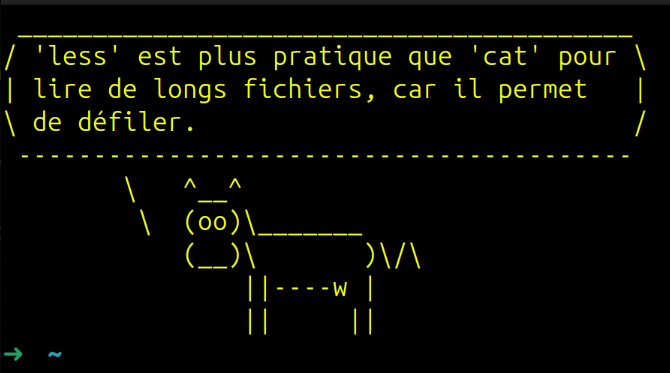

# Les Formidables Conseils du Terminal / Awesome Term Tips 

## Voici une petite collection de conseils pour le terminal.

`fortune` est appelé à chaque ouverture d'un nouveau terminal et affiche un petit conseil, le tout décoré avec `cowsay`. Rien de bien fou.
N'hésitez pas à ajouter ou corriger des conseils.


## Installation

Deux packages sont necessaire
```bash
sudo apt install fortune-mod cowsay 
```

```bash
./install.sh french bash
```
be sure to source your .profile from your shell conf : 
- zsh : 
```bash
echo "source ~/.profile" >> .zshrc;
```
- bash : 
```bash
echo "source ~/.profile" >> .bashrc;
```
## Usage
un tips se lance a chaque ouverture de terminal mais vous pouvez egalement appeller le scrip avec la commande :
```bash
cowtips [language] [techno] 
```
## Désintallation
```bash
cowtips uninstall
```

## Example



## Motivation 

Ce projet a pour but d’aider, au quotidien, les utilisateurs de distributions Linux, notamment ceux en apprentissage, à découvrir de nouvelles techniques d’utilisation du terminal.

L’intérêt du français dans ce projet est de rendre ces conseils accessibles aux étudiants français, pour qui la langue anglaise pourrait être un obstacle à leur apprentissage.

Je ne suis d’ailleurs pas du tout fermé à l’idée de traduire ces conseils dans plusieurs langues !


## Contribution

J’aimerais ajouter, au fur et à mesure, des conseils sur d’autres technologies et également enrichir l’existant.
Toute contribution est la bienvenue !